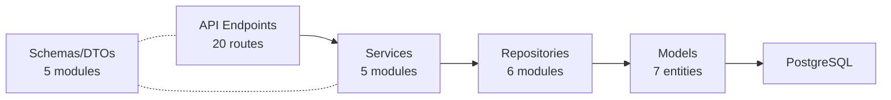

# Walkthrough — N-Layer Architecture Implementation

## Tổng quan

Đã triển khai kiến trúc **N-Layer** hoàn chỉnh cho RagDraftingAI Backend, mapping **7 thực thể** từ `schema.md` qua **5 layers** với **20 API endpoints**.

## Cấu trúc N-Layer



## Các thay đổi

### Layer 5: Domain Models (ORM)

| File | Entity | Enums |
|------|--------|-------|
| [user.py](file:///Users/capkimkhanh/Documents/RagDraftingAI/BACKEND/app/models/user.py) | `User` | `UserRole(admin, user, moderator)` |
| [audit_log.py](file:///Users/capkimkhanh/Documents/RagDraftingAI/BACKEND/app/models/audit_log.py) | `AuditLog` | `AuditAction(login, logout, ...)` |
| [chat_session.py](file:///Users/capkimkhanh/Documents/RagDraftingAI/BACKEND/app/models/chat_session.py) | `ChatSession` | — |
| [chat_message.py](file:///Users/capkimkhanh/Documents/RagDraftingAI/BACKEND/app/models/chat_message.py) | `ChatMessage` | `MessageRole(user, assistant, system)` |
| [document.py](file:///Users/capkimkhanh/Documents/RagDraftingAI/BACKEND/app/models/document.py) | `Document` | `DocStatus(pending, processing, ready, failed)` |
| [document_chunk.py](file:///Users/capkimkhanh/Documents/RagDraftingAI/BACKEND/app/models/document_chunk.py) | `DocumentChunk` | — |
| [query_log.py](file:///Users/capkimkhanh/Documents/RagDraftingAI/BACKEND/app/models/query_log.py) | `QueryLog` | — |

---

### Layer 4: Repository (Data Access) — NEW

| File | Scope |
|------|-------|
| [base_repo.py](file:///Users/capkimkhanh/Documents/RagDraftingAI/BACKEND/app/repositories/base_repo.py) | Generic CRUD (get_by_id, get_all, create, update, delete) |
| [user_repo.py](file:///Users/capkimkhanh/Documents/RagDraftingAI/BACKEND/app/repositories/user_repo.py) | + get_by_username, get_by_role, get_by_department |
| [audit_repo.py](file:///Users/capkimkhanh/Documents/RagDraftingAI/BACKEND/app/repositories/audit_repo.py) | + date_range filter, blocks update/delete |
| [chat_repo.py](file:///Users/capkimkhanh/Documents/RagDraftingAI/BACKEND/app/repositories/chat_repo.py) | Session + Message repos, archive support |
| [document_repo.py](file:///Users/capkimkhanh/Documents/RagDraftingAI/BACKEND/app/repositories/document_repo.py) | Status lifecycle, bulk chunk creation |
| [query_log_repo.py](file:///Users/capkimkhanh/Documents/RagDraftingAI/BACKEND/app/repositories/query_log_repo.py) | Session filter, recent queries |

---

### Layer 2: Schemas/DTOs

| File | Key Classes |
|------|-------------|
| [user.py](file:///Users/capkimkhanh/Documents/RagDraftingAI/BACKEND/app/schemas/user.py) | UserCreate, UserLogin, UserUpdate, UserResponse, Token |
| [chat.py](file:///Users/capkimkhanh/Documents/RagDraftingAI/BACKEND/app/schemas/chat.py) | ChatSessionCreate, ChatMessageCreate, responses |
| [document.py](file:///Users/capkimkhanh/Documents/RagDraftingAI/BACKEND/app/schemas/document.py) | DocumentResponse, DocumentChunkResponse, paginated lists |
| [audit.py](file:///Users/capkimkhanh/Documents/RagDraftingAI/BACKEND/app/schemas/audit.py) | AuditLogResponse, AuditLogFilter |
| [query_log.py](file:///Users/capkimkhanh/Documents/RagDraftingAI/BACKEND/app/schemas/query_log.py) | QueryLogResponse |

---

### Layer 3: Services

| File | Methods |
|------|---------|
| [auth_service.py](file:///Users/capkimkhanh/Documents/RagDraftingAI/BACKEND/app/services/auth_service.py) | register(), login() |
| [user_service.py](file:///Users/capkimkhanh/Documents/RagDraftingAI/BACKEND/app/services/user_service.py) | get_user(), list_users(), update_profile(), admin_update_user() |
| [chat_service.py](file:///Users/capkimkhanh/Documents/RagDraftingAI/BACKEND/app/services/chat_service.py) | Session CRUD + Message add/get |
| [document_service.py](file:///Users/capkimkhanh/Documents/RagDraftingAI/BACKEND/app/services/document_service.py) | Upload, list, status management, chunk creation |
| [audit_service.py](file:///Users/capkimkhanh/Documents/RagDraftingAI/BACKEND/app/services/audit_service.py) | log_action(), filtered retrieval |

---

### Layer 1: API Endpoints

| Route | Method | Auth |
|-------|--------|------|
| `/api/v1/auth/register` | POST | — |
| `/api/v1/auth/login` | POST | — |
| `/api/v1/users/me` | GET, PUT | User |
| `/api/v1/chat/sessions` | GET, POST | User |
| `/api/v1/chat/sessions/{id}` | GET, PUT, DELETE | User (owner) |
| `/api/v1/chat/sessions/{id}/messages` | GET, POST | User (owner) |
| `/api/v1/documents/upload` | POST | User |
| `/api/v1/documents` | GET | User |
| `/api/v1/documents/{id}` | GET, DELETE | User |
| `/api/v1/documents/{id}/chunks` | GET | User |
| `/api/v1/admin/audit-logs` | GET | Admin |
| `/api/v1/admin/users` | GET | Admin |
| `/api/v1/admin/users/{id}` | PUT | Admin |

---

### Infrastructure Updates

| File | Change |
|------|--------|
| [config.py](file:///Users/capkimkhanh/Documents/RagDraftingAI/BACKEND/app/core/config.py) | Pydantic Settings for all env vars |
| [security.py](file:///Users/capkimkhanh/Documents/RagDraftingAI/BACKEND/app/core/security.py) | JWT + bcrypt password hashing |
| [session.py](file:///Users/capkimkhanh/Documents/RagDraftingAI/BACKEND/app/db/session.py) | Refactored to use Settings |
| [base.py](file:///Users/capkimkhanh/Documents/RagDraftingAI/BACKEND/app/db/base.py) | Imports all 7 models |
| [main.py](file:///Users/capkimkhanh/Documents/RagDraftingAI/BACKEND/app/main.py) | Includes API router at /api/v1 |
| [requirements.txt](file:///Users/capkimkhanh/Documents/RagDraftingAI/BACKEND/requirements.txt) | +pydantic-settings, python-jose, passlib, python-multipart |

## Verification

```
✅ All 7 tables registered: users, audit_logs, chat_sessions, 
   chat_messages, documents, document_chunks, query_logs

✅ All 20 API routes registered correctly

✅ Dependencies installed successfully
```

## TODO (Future)
- MinIO file upload integration in `upload.py`
- RAG module implementation (`rag/` directory)
- Alembic database migration setup
- Full server start test with PostgreSQL running